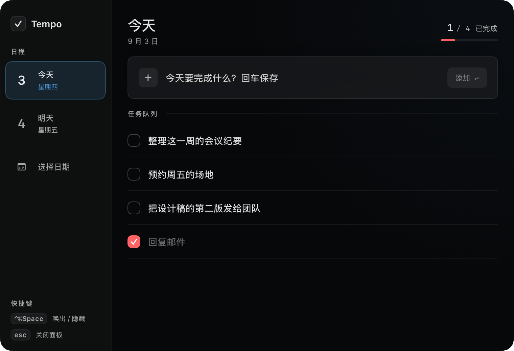

# TempoTasks

A keyboard-first menu bar task list for macOS. Everything stays on your Mac.



TempoTasks 是一个常驻菜单栏的轻量任务工具。按 `Control + Command + Space` 唤出面板，输入一行文字回车即可记下，任务归属今天、明天或任意一天。数据用 SwiftData 存在本机，不读取系统日历，不联网，不上传云端。

它解决的是一个很窄的问题：想记一件事的时候，不想为此打开一个完整的任务管理应用、等它加载、再找到「新建」按钮。

## 功能

- **全局快捷键唤出**：默认 `Control + Command + Space`，面板在当前屏幕顶部居中；再按一次收起。
- **快捷键可改**：在面板左下角点当前键帽，直接按下新组合。按 Escape 放弃，点回转箭头恢复默认。
- **三种日期归属**：今天、明天，或从日历里挑一天。左栏会记住你选的那天。
- **一行一个任务**：回车保存，不弹窗、不跳转、不要求填任何其他字段。
- **删除可撤销**：删掉后有 5 秒的撤销窗口。
- **面板可拖动**：拖到顺手的位置，当前会话内保持不变。
- **跟随系统日期变化**：跨过午夜或切换时区后，「今天」会自动重新计算。

## 系统要求

- macOS 14.0 或更高
- 构建需要 Swift 6.0 工具链（Xcode 16 或更新版本）

## 构建

仓库不提供预编译产物，需要自己构建：

```bash
git clone https://github.com/edmond-byte333/TempoTasks.git
cd TempoTasks
./scripts/build-app.sh
open build/TempoTasks.app
```

构建脚本使用 ad-hoc 签名（本机没有 Apple Developer 证书），产物只在本机可用，不适合分发给别人。

首次运行后，菜单栏会出现一个勾选框图标。应用是 `LSUIElement`，不在 Dock 里显示。

## 使用

| 操作 | 快捷键 |
| --- | --- |
| 唤出 / 隐藏面板 | `Control + Command + Space`（可改） |
| 保存当前输入 | `Return` |
| 关闭面板 | `Escape` |

点菜单栏图标同样可以打开面板，右键图标可以看到快捷键状态和退出选项。

### 快捷键被占用时

如果你设的组合已被系统或别的应用注册，面板左下角和菜单栏都会标为「被占用」，此时仍可点菜单栏图标打开面板。换一个组合即可。

新组合至少要包含 Control、Option 或 Command 其中之一，否则正常打字就会误触发。macOS 要求全局快捷键必须带一个实体主键，所以只按住修饰键（比如仅 Control + Command）是注册不了的。

旧版本默认的 `Control + Space` 常被 macOS 的输入法切换占用，这也是默认值改成 `Control + Command + Space` 的原因。

## 数据与隐私

- 任务通过 SwiftData 存在本机应用容器内。
- 不读取系统日历、提醒事项或任何其他应用的数据。
- 不发起任何网络请求，没有账号、同步或遥测。
- 快捷键设置存在本机偏好设置里。

## 开发

```bash
swift build     # 构建
swift test      # 运行测试（24 个）
```

项目结构：

```
Sources/TempoTasks/
├── App/        菜单栏、悬浮面板、全局热键、位置记忆
├── UI/         SwiftUI 视图与设计 token
├── Features/   面板状态与业务动作
├── Models/     任务与本地日期
└── Data/       SwiftData 仓储
```

界面的配色职责、间距刻度、动效时长等约定写在 [DESIGN.md](DESIGN.md)。改 UI 前建议先读一遍——里面的规则是有意为之的，比如珊瑚红只表示完成与错误、蓝色只表示焦点与选中，两者不互换。

设计与实现过程的记录在 [docs/](docs/)。
